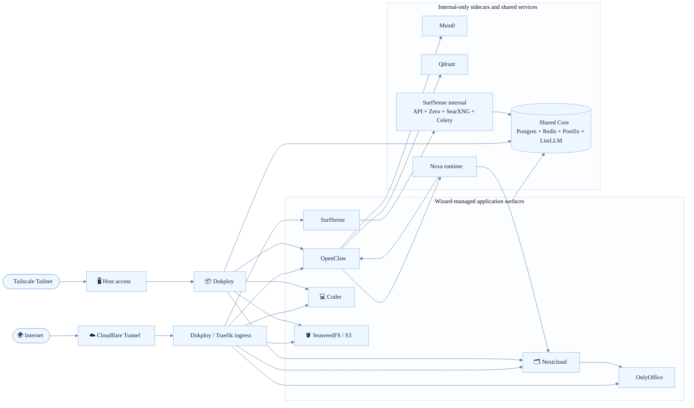
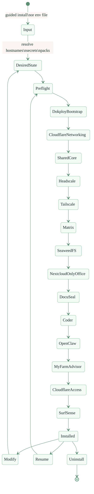
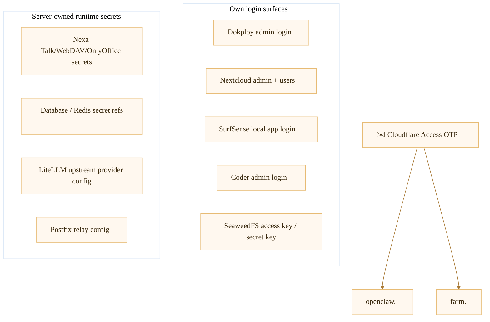

# Dokploy Wizard

Dokploy Wizard is a Python-first installer for standing up a real self-hosted stack on a fresh Ubuntu VPS with Dokploy, Cloudflare Tunnel, optional Cloudflare Access, optional Tailscale host access, and a set of opinionated application packs.

Today this repo is not a scaffold or mock planner. It performs real deployment, real rerun/modify/uninstall flows, and has been validated on fresh VPS rebuilds.

## What it installs

- **Dokploy** as the deployment control plane
- **Cloudflare Tunnel** for public ingress
- **Cloudflare Access** for browser-safe advisor surfaces
- **Tailscale** for private/admin host access
- **Shared Core** services used by packs
  - PostgreSQL
  - Redis
  - Postfix mail relay
  - LiteLLM AI gateway
- **Nextcloud + OnlyOffice + Talk**
- **Moodle**
- **DocuSeal**
- **OpenClaw** (user-visible name: **Nexa Claw**)
- **Nexa**, embedded inside OpenClaw as the Nextcloud/Talk/OnlyOffice-facing agent runtime
- **Telly**, embedded inside OpenClaw as the Telegram-facing agent persona
- **My Farm Advisor** (user-visible name: **Nexa Farm**) — separate advisor runtime with Field Operations and Data Pipeline workspaces
- **SurfSense** — optional research/chat pack with app-login-only access and LiteLLM-routed models
- **SeaweedFS** for S3-compatible object storage
- **Coder** with a seeded Ubuntu + VS Code workspace template

Optional packs also include Headscale, Matrix, Coder, My Farm Advisor, and SurfSense. My Farm Advisor and SurfSense can run side-by-side with OpenClaw.

## Current reality

- Fresh-VPS install works
- Same-host rerun / noop proof works
- fresh-VPS install, rerun, and inspect-state flows are part of the validation path
- OpenClaw, Nexa, Nextcloud Talk, OnlyOffice, SeaweedFS, Coder, and SurfSense are all part of the wizard-managed path
- Unchanged healthy services skip Dokploy update/deploy on rerun through compose artifact hash tracking

## High-level architecture



## Install and lifecycle flow



## What each major surface does

### Dokploy

Dokploy is the control plane the wizard targets for all compose app deployment. The wizard bootstraps Dokploy, mints or reuses an API key, and then uses that API key for all managed pack operations.

After LiteLLM is ready, the wizard also reconciles Dokploy's built-in AI provider named `Dokploy Wizard LiteLLM`. That provider points at the wizard-managed internal LiteLLM gateway and uses the dedicated `dokploy-ai` virtual key restricted to the resolved default model alias, not the LiteLLM master key.

### Shared Core

Shared Core is the common substrate for packs that need databases, cache, mail relay, or AI gateway access. It is installed as core infrastructure before the optional application packs that depend on it.

Today Shared Core includes:

- **PostgreSQL** for Coder, Nextcloud, OpenClaw, SurfSense, and other packs that need wizard-owned relational storage.
- **Redis** for Nextcloud, SurfSense, and packs that need cache or queue backing.
- **Postfix** as the wizard-managed mail relay surface for services that need SMTP/mail delivery. It centralizes the relay endpoint inside the stack; it does not imply every application has complete mail workflows configured by default.
- **LiteLLM** as the central AI passthrough/gateway for wizard-managed services deployed through Dokploy.

These are wizard-owned resources, tracked in the ownership ledger, and reused across modify / rerun operations.

LiteLLM is the AI boundary for the stack. Services use the internal Docker-network URL `http://<stack-name>-shared-litellm:4000` and receive wizard-managed virtual keys or generated gateway defaults. Upstream provider keys terminate at LiteLLM instead of being copied into each application container. The public `litellm.<root-domain>` admin hostname exists for operator management and stays Cloudflare Access-protected; service-to-service traffic should stay on the shared internal network.

### Nextcloud + OnlyOffice + Talk

The `nextcloud` pack always includes OnlyOffice as its paired document editor runtime and Talk for real-time chat/voice/video.

What the wizard wires today:

- Nextcloud service + persistent volume
- OnlyOffice service + persistent volume
- shared-core Postgres + Redis bindings
- trusted domain configuration
- OnlyOffice JWT configuration wiring
- Nextcloud Talk app verification
- OpenClaw workspace mount into Nextcloud when Nexa is enabled

### OpenClaw

OpenClaw is deployed as an advisor runtime with:

- browser-facing access through Cloudflare Tunnel
- Cloudflare Access OTP protection on its public hostname
- trusted-proxy browser auth for the Control UI
- generated gateway config and agent bindings
- `gateway.http.endpoints.responses.enabled = true` so internal adapters can hand requests into OpenClaw’s own runtime

### Nexa

Nexa is **not** a standalone pack. It is embedded inside the OpenClaw deployment when `OPENCLAW_NEXA_*` env values are present.

Nexa’s current role is to bridge OpenClaw into the Nextcloud ecosystem:

- Nextcloud Talk message handling
- Nextcloud file creation and sharing via WebDAV/OCS
- OnlyOffice callback ingestion and reconcile contract wiring
- Mem0-backed memory lookup and memory write policy
- OpenClaw pass-through for grounded tool use and command execution

The important design point is that Nexa is not just a prompt file. The wizard deploys a dedicated `nexa-runtime` sidecar and associated contract files under the OpenClaw volume, but some Talk and OnlyOffice behaviors are still intentionally conservative and continue to depend on upstream OpenClaw/runtime behavior.

### Telly

Telly is the Telegram-facing OpenClaw agent persona. Like Nexa, it is seeded by the OpenClaw deployment code rather than installed as a separate pack.

What the wizard currently does for Telly:

- seeds a dedicated Telegram-facing agent persona
- binds the Telegram channel to `telly`
- configures Telegram DM allowlist / ownership values from `OPENCLAW_TELEGRAM_*`
- seeds a `workspace-telly` with operator-facing guidance files

### My Farm Advisor

My Farm Advisor is a separate advisor runtime from OpenClaw. It runs its own container image (`ghcr.io/borealbytes/my-farm-advisor:latest`) on its own hostname (default `farm.<root-domain>`) and does not share the OpenClaw Nexa sidecars.

What the wizard does for My Farm Advisor:

- deploys a standalone service with its own Dokploy compose app
- wires Cloudflare Access OTP on `farm.<root-domain>`
- seeds two workspaces under `/data`: `workspace` (field ops) and `workspace-data-pipeline`
- mounts both workspaces into Nextcloud as external storage when Nextcloud is enabled
- maps wizard env keys into the container using a dedicated farm runtime contract so farm-only flags cannot leak into OpenClaw

My Farm Advisor and OpenClaw can run side by side. There is no slot conflict.

### SurfSense

SurfSense is an optional research/chat pack. It is deployed as a normal Dokploy compose app, but it uses wizard-managed shared infrastructure instead of bringing its own database, cache, or model gateway.

Public hostnames:

| Hostname | What it serves |
|---|---|
| `surfsense.<root-domain>` | SurfSense frontend |
| `surfsense-api.<root-domain>` | SurfSense API |
| `surfsense-zero.<root-domain>` | SurfSense Zero cache service |

Auth and ingress behavior:

- SurfSense is **app-login-only**. The wizard bootstraps the first local user with the Dokploy admin email and password.
- SurfSense is **not** placed behind Cloudflare Access OTP. Its public surfaces rely on the app login and service-specific routes.
- SearXNG, Celery worker, Celery beat, and database migrations are internal-only compose services. They do not get public hostnames.

Shared service behavior:

- SurfSense uses wizard-managed shared Postgres. The migration role gets the database permissions needed for SurfSense and Zero publication setup.
- SurfSense uses wizard-managed shared Redis for cache and queue paths.
- SurfSense uses wizard-managed shared LiteLLM at `http://<stack-name>-shared-litellm:4000` for model calls.
- SurfSense receives a generated LiteLLM virtual key restricted to wizard-approved aliases. Upstream provider keys stay at LiteLLM and are not passed into SurfSense.

Model behavior inside SurfSense:

- SurfSense model labels are rendered as `LiteLLM - <alias>`, so users see the gateway-backed alias they are selecting.
- Local private model traffic goes through LiteLLM when `LITELLM_LOCAL_BASE_URL` is configured. The wizard-generated LiteLLM config includes the compatibility setting needed for local chat templates that reject non-leading system messages.
- OpenCode Go aliases also go through LiteLLM when `LITELLM_OPENCODE_GO_API_KEY` is set.
- SurfSense never receives raw OpenRouter, NVIDIA, OpenCode Go, or local upstream provider keys.

### Coder

Coder gets a seeded Ubuntu + VS Code template and a first default workspace.

On first successful bootstrap the wizard:

- provisions the initial Coder admin
- pushes the seeded templates:

  | Template | What it provides |
  |---|---|
  | `ubuntu-vscode` | Base Ubuntu + VS Code with `curl`, `git`, `wget`, `btop`, `opencode`, `zellij`, `pi` CLI |
  | `ubuntu-vscode-opencode-web` | OpenCode Web (browser-based IDE) |
  | `ubuntu-vscode-openwork` | OpenWork (AI-assisted workspace) |
  | `ubuntu-vscode-kdense-byok` | K-Dense BYOK (Bring Your Own Key for local model inference) |
  | `ubuntu-vscode-hermes` | Hermes (on-device AI assistant) |
  | `ubuntu-vscode-pi-web` | Pi CLI plus clickable Pi Web UI (Coder app, not a public Dokploy pack) |

- creates a default workspace for the operator

That default template installs:

- `curl`
- `git`
- `wget`
- `btop`
- `opencode`
- `zellij`

The workspace home directory lives on a per-workspace Docker volume. The control plane state lives in shared-core Postgres.

### Coder App Hostnames

The wizard supports two different ideas for how browser-facing Coder apps should be routed:

- The ideal Coder-native shape is `*.coder.<root-domain>`.
- The currently selected no-fee fallback is `*.<root-domain>` limited by a strict app-host pattern, so only Coder app-style hostnames route into Coder.

Why the fallback exists:

- Cloudflare Universal SSL on a full zone covers the zone apex and first-level subdomains.
- A hostname like `foo.coder.example.com` is a deeper subdomain and is not covered by Universal SSL.
- Cloudflare's supported paid fix is Advanced Certificate Manager, which can issue edge certificates for `*.coder.<root-domain>`.

Current decision:

- Keep the fallback `*.<root-domain>` for live installs until a future architecture change is chosen.
- Preserve a strict router pattern so service hosts like `dokploy.<root-domain>`, `nextcloud.<root-domain>`, and `openclaw.<root-domain>` are not hijacked by Coder.

Future architecture options:

1. Keep the current fallback: lowest risk and already working. Coder app hosts look like `app--workspace--user.<root-domain>`.
2. Use `*.coder.<root-domain>` with Cloudflare Advanced Certificate Manager: closest to the Coder docs and cleanest hostname model, but requires ACM on the zone.
3. Keep `*.coder.<root-domain>` but move Coder off Cloudflare Tunnel: terminate public TLS directly in Dokploy/Traefik using DNS-01 wildcard certificates. This avoids the ACM fee but changes the ingress architecture for Coder.
4. Convert selected Coder apps to path-based routing: works without wildcard subdomain TLS, but app compatibility is weaker than subdomain routing and usually requires template-specific base-path work.

Operational note:

- Hermes, OpenCode Web, and OpenWork are already path-based Coder apps in this repo.
- K-Dense BYOK is the current outlier that uses `subdomain = true` and benefits the most from proper wildcard app routing.

### SeaweedFS

SeaweedFS provides the S3-compatible object-storage surface. The wizard wires:

- service + data volume
- generated access key + secret key in guided mode
- public `s3.<root-domain>` hostname

## Auth and credential model

### Auth boundaries at a glance



### Which surfaces are behind OTP

Current Cloudflare Access scope:

- `openclaw.<root-domain>`
- `farm.<root-domain>`
- `litellm.<root-domain>` for LiteLLM admin access

Not behind Cloudflare Access in the current implementation:

- `dokploy.<root-domain>`
- `nextcloud.<root-domain>`
- `office.<root-domain>`
- `s3.<root-domain>`
- `surfsense.<root-domain>`
- `surfsense-api.<root-domain>`
- `surfsense-zero.<root-domain>`
- `coder.<root-domain>`
- Coder workspace app hosts, currently routed via a controlled `*.<root-domain>` fallback
- `matrix.<root-domain>`
- `headscale.<root-domain>`

Why:

- Dokploy still needs a usable API/control plane path
- Nextcloud and OnlyOffice have client/protocol concerns
- SeaweedFS is an object-storage protocol surface
- SurfSense has its own app login and API routing
- Coder has its own application login
- Matrix and Headscale are protocol/control-plane surfaces

### Which things have their own login/credentials

| Surface | Credential model | Source |
|---|---|---|
| Dokploy | admin email + password, then API key | operator-supplied + wizard-generated API key |
| OpenClaw | Cloudflare Access OTP + trusted-proxy browser auth, plus gateway password/token surfaces | generated gateway password, optional token |
| Nextcloud | admin user/password and internal service accounts | currently derived from Dokploy admin credentials, plus Nexa service account from env |
| OnlyOffice | JWT integration value shared with Nextcloud | currently wired by deployment bootstrap/runtime config |
| Coder | Coder admin login | currently derived from Dokploy admin credentials |
| SeaweedFS / S3 | access key + secret key | wizard-generated in guided mode or env-file provided |
| SurfSense | local app login, plus internal service credentials | first user from Dokploy admin credentials; app/runtime secrets are wizard-generated and state-backed |
| Nexa internals | Talk/WebDAV/OnlyOffice/API secrets | server-owned env |

### Credential sources

The wizard currently uses three broad credential sources:

1. **Operator-supplied values**
   - Cloudflare token/account/zone
   - Dokploy admin login
   - Tailscale auth key
   - model/provider API keys that LiteLLM uses upstream

2. **Wizard-generated values**
   - SeaweedFS access key + secret key in guided mode
   - OpenClaw browser/control password in guided mode
   - My Farm Advisor browser/control password in guided mode
   - SurfSense app/runtime secrets
   - SurfSense LiteLLM virtual key
   - Dokploy API key after bootstrap

3. **Server-owned runtime secrets**
   - Nextcloud and Nexa runtime integration values
   - Nexa Talk signing/shared secrets
   - Nexa WebDAV auth
   - Nexa service-account credentials
   - Mem0/Qdrant private runtime configuration
   - SurfSense SearXNG, Zero, migration, and app-secret values
   - shared Postfix relay configuration consumed by services that need SMTP/mail delivery

### Nexa credential mediation

Nexa is intentionally treated as a server-owned runtime surface.

That means:

- the wizard keeps sensitive Nexa values in env/config surfaces owned by the deployment
- the Nextcloud-visible Nexa workspace is an operator/user surface, not the source of truth
- the runtime contract records **presence and source**, not raw secret values

## Current install file expectations

The current repo uses `.install.env` at repo root as the working operator env file. The checked-in `.install.env.example` is the safe starting point for operators.

Recommended setup:

```bash
cp .install.env.example .install.env
chmod 0600 .install.env
```

Then edit `.install.env` and replace placeholders with operator-owned values.

### Cloudflare values

Use Cloudflare values for the one account and one zone that will host this stack. In the Cloudflare dashboard, find the Account ID from Account home by using the account row menu and selecting Copy account ID. Find the Zone ID by opening the target domain and copying Zone ID from the Overview page API section.

Create a Cloudflare API token for the wizard instead of using a Global API Key. Scope the token to the target account and target zone. The token needs Zone DNS Edit for the target zone, plus account-level Cloudflare Tunnel Edit or the current Cloudflare One connector write permission for the target account so the wizard can manage the tunnel and route hostnames. If Cloudflare Access OTP apps are enabled, also grant Access Apps Write/Edit and Access Policies Write/Edit on the target account. Do not use all-account or all-zone scopes unless you are testing in a disposable Cloudflare account.

Important details:

- `.install.env.example` is placeholder-only. It documents the expected key groups without storing live secrets.
- `.install.env` contains real Cloudflare credentials, Dokploy credentials, optional Tailscale values, and optional upstream model-provider keys. Keep it `0600` and uncommitted.
- `.install.env` stays flat. It contains `key=value` pairs, not nested LiteLLM config or generated app state.
- `STACK_NAME` defaults from `ROOT_DOMAIN` by lowercasing it and replacing dots or other unsafe characters with hyphens, so `openmerge.me` becomes `openmerge-me`. Wizard-managed Dokploy projects, Docker networks, services, volumes, and tunnel names use that prefix. Set `STACK_NAME` only to preserve an existing explicit stack name.
- `PACKS` can include `surfsense` alongside packs such as `nextcloud`, `openclaw`, `my-farm-advisor`, `seaweedfs`, `coder`, and `docuseal`.
- Nexa functionality is enabled by the presence of `OPENCLAW_NEXA_*` values.
- SurfSense hostnames default to `SURFSENSE_SUBDOMAIN=surfsense`, `SURFSENSE_API_SUBDOMAIN=surfsense-api`, and `SURFSENSE_ZERO_SUBDOMAIN=surfsense-zero`.
- Generated values such as Dokploy API keys, SurfSense app secrets, SurfSense database/runtime secrets, SurfSense Zero admin password, and LiteLLM virtual keys are state-backed. Do not hand-fill them for normal installs.
- `DOKPLOY_SUBDOMAIN` defaults to `dokploy`; set it only when you need a different Dokploy hostname.
- `MY_FARM_ADVISOR_SUBDOMAIN` defaults to `farm` when the My Farm Advisor pack is enabled; set it only when you need a different farm hostname.
- The remote proof helper copies `.install.env` explicitly to the remote host during validation.

## Current fresh-VPS proof status

The repo includes a real fresh-VPS proof flow with:

- first install success
- service verification after install
- `inspect-state` execution as part of the proof loop
- optional strict idempotency mode for explicit double-install checks

The local proof artifacts live under:

- `.sisyphus/evidence/fresh-vps-validation/fresh-reinstall-live-proof/`

What that means in practice:

- the wizard can package the repo and install env
- copy both to a fresh host
- run the installer non-interactively
- verify that all enabled services are healthy and reachable
- inspect the resulting state as part of the same reproducibility loop

### Default proof behavior (verification-first)

By default, proof installs once, runs service verification, and then captures `inspect-state`. It does not run a second install pass. This is the standard operator path for validating a fresh host.

```bash
./bin/dokploy-wizard-remote proof \
  --host <host> \
  --password <redacted> \
  --env-file ./.install.env \
  --verbose
```

This is the normal clean-VPS validation command shape for the current stack. Use it after filling `.install.env` from `.install.env.example`. Do not read this README as claiming the exact current branch has passed a fresh clean-VPS proof unless a matching proof artifact or operator run says so.

### Strict idempotency mode

Use `--strict-idempotency` when you want an explicit double-install check. The second install pass should produce zero Dokploy update/deploy calls for unchanged healthy services because compose artifact hash tracking skips mutations when the rendered compose is unchanged and verification passes.

```bash
./bin/dokploy-wizard-remote proof \
  --host <host> \
  --password <redacted> \
  --env-file ./.install.env \
  --strict-idempotency
```

### Service verification runner

The proof flow invokes the service verification runner after install. You can also run it independently:

```bash
python3 -m dokploy_wizard.service_verification_runner \
  --env-file ./.install.env \
  --state-dir .dokploy-wizard-state
```

The checked-in proof artifact is useful as a concrete example run, but it should not be treated as the only source of truth for current drift status after later inspection fixes.

## Install modes

### Guided first-run install

```bash
./bin/dokploy-wizard install
```

Use this when you do not already have an env file. The wizard prompts for domains, Dokploy credentials, Cloudflare values, optional Tailscale settings, and pack selection, then writes a reusable env file and runs the same install flow as env-file mode.

### Env-file install

```bash
./bin/dokploy-wizard install --env-file path/to/install.env --non-interactive
```

### Inspect state

```bash
./bin/dokploy-wizard inspect-state --env-file path/to/install.env --state-dir .dokploy-wizard-state
```

### Modify / rerun / uninstall

```bash
./bin/dokploy-wizard modify --env-file path/to/install.env --non-interactive
./bin/dokploy-wizard uninstall --retain-data --non-interactive --confirm-file fixtures/retain.confirm
./bin/dokploy-wizard uninstall --destroy-data --non-interactive --confirm-file fixtures/destroy.confirm
```

## Fresh-VPS harness

The repo also contains a real fresh-host validation harness:

```bash
python -m src.dokploy_wizard.fresh_vps_validation_harness \
  --install-env-file ./.install.env \
  --target-host <host> \
  --target-user root \
  --target-password <password> \
  --target-path /root/dokploy-proof \
  --label proof-run
```

What it does:

- packages the repo
- uploads repo + `.install.env`
- runs wizard install
- runs service verification
- runs `inspect-state`
- collects remote state and logs locally

The harness does not rerun install by default. Use `--strict-idempotency` with `./bin/dokploy-wizard-remote proof` when you need an explicit unchanged-healthy idempotency check.

For day-to-day clean VPS validation, prefer the remote wrapper because it packages the repo, uploads `.install.env`, runs install, verifies enabled services, runs `inspect-state`, and collects logs in one operator-facing flow:

```bash
./bin/dokploy-wizard-remote proof \
  --host <host> \
  --password <redacted> \
  --env-file ./.install.env \
  --verbose
```

## Local validation

Quick checks:

```bash
pytest -q
ruff check .
mypy .
```

Focused modules that matter most for the current stack:

```bash
pytest tests/unit/test_openclaw_pack.py -q
pytest tests/unit/test_nextcloud_pack.py -q
pytest tests/unit/test_nexa_runtime.py -q
pytest tests/integration/test_openclaw_pack.py -q
pytest tests/integration/test_nextcloud_pack.py -q
pytest tests/test_cli.py -q
```

## Operator notes

- This is still a **fresh-host** workflow, not a general migration framework.
- Docker can be bootstrap-remediated by the wizard on supported Ubuntu hosts.
- The chosen state directory stores wizard metadata and the generated env file, not the Docker volumes themselves.
- The ownership ledger is the uninstall authority.
- OpenClaw/Nexa/Telly behavior is now wizard-managed, not just manually drifted on one VPS.
- Reruns and modify operations skip Dokploy update/deploy for services whose rendered compose hash matches the stored hash and whose verification checks pass. Changed compose or unhealthy services still redeploy normally.

## Current caveats

- Dokploy itself is not yet protected by Cloudflare Access because the wizard still needs a safe machine-auth/control path.
- Nexa features are env-gated, not universal defaults. For your deployment that is fine, because `.install.env` already carries the required `OPENCLAW_NEXA_*` values.
- Some channel/runtime behavior still depends on the upstream OpenClaw image, so operational behavior can evolve as that image evolves.
- For the OpenClaw trusted-proxy control UI scope regression and the bootstrap fixes that keep fresh installs repeatable, see `docs/incidents/openclaw-trusted-proxy-scopes.md`.

## LiteLLM core gateway

LiteLLM is always installed as core infrastructure. It is not a pack you opt into, and it runs as a shared-core service alongside Postgres, Redis, and Postfix. It is the single internal AI passthrough for wizard-managed Dokploy services: services call LiteLLM, and LiteLLM calls the configured upstream model providers.

Primary consumers today are:

- Dokploy's built-in AI provider (`Dokploy Wizard LiteLLM`)
- OpenClaw and its embedded Nexa/Telly runtime paths
- My Farm Advisor
- SurfSense
- Coder Hermes and Coder K-Dense
- Coder OpenCode Web and OpenWork through generated template gateway defaults

Those services use internal gateway config or wizard-managed virtual keys. They should not receive raw OpenRouter, NVIDIA, OpenCode Go, local model, or other upstream provider keys directly when the wizard-managed LiteLLM path is in use. Pi Web UI remains the exception because its browser-local provider-key flow is intentionally unchanged and this repo does not control a Pi scoped-models endpoint.

### Flat env inputs

The operator env file stays flat. `.install.env` contains only key=value pairs. The wizard reads upstream provider inputs such as local model, OpenRouter, OpenCode Go, and NVIDIA values, then generates the nested LiteLLM `config.yaml` internally during deployment. You do not edit raw LiteLLM proxy config by hand.

### Model allowlist and default order

The generated LiteLLM config enforces a strict precedence:

1. `local-model.internal/unsloth-active` — a private OpenAI-compatible endpoint, when `LITELLM_LOCAL_BASE_URL` is configured
2. `opencode-go/*` — explicit OpenCode Go aliases covering the OpenCode Go provider fleet
3. `openrouter/*` — explicit OpenRouter aliases, each declared individually with `alias=target-model` pairs in `LITELLM_OPENROUTER_MODELS`

OpenRouter wildcard routes are not allowed. The config renderer rejects `openrouter/*` or broad `*` aliases.

SurfSense receives the same approved alias list through its generated LiteLLM virtual key. Inside SurfSense, model labels are displayed as `LiteLLM - <alias>`. That keeps the user-facing choice clear while keeping upstream keys at LiteLLM.

### AI env contract

The preferred way to select the default model is with `AI_DEFAULT_PROVIDER` and `AI_DEFAULT_MODEL`:

```bash
AI_DEFAULT_PROVIDER=openrouter
AI_DEFAULT_MODEL=deepseek/deepseek-v4-flash:free
```

Together these resolve to the canonical alias `openrouter/deepseek/deepseek-v4-flash:free`. If you omit them, the wizard falls back to legacy `ADVISOR_MODEL_PROVIDER` and `ADVISOR_MODEL_NAME`.

For LiteLLM upstream API keys, the canonical names are `LITELLM_OPENROUTER_API_KEY` and `LITELLM_OPENCODE_GO_API_KEY`. The older bare keys `OPENROUTER_API_KEY` and `OPENCODE_GO_API_KEY` are still accepted as compatibility fallbacks. The old alias `local/unsloth-active` is also resolved to the canonical alias when it appears in legacy env values.

`LITELLM_OPENCODE_GO_API_KEY` is the OpenCode Go upstream credential. When it is set, generated OpenCode Go aliases are exposed through LiteLLM to approved consumers such as SurfSense, without copying that upstream key into the app container.

Local model compatibility is handled in the generated LiteLLM config. For a private local-model path such as `local-model.internal/unsloth-active`, LiteLLM adapts system-message handling before forwarding to the local OpenAI-compatible endpoint, which keeps SurfSense chats working with local unsloth templates.

### Virtual keys

The wizard auto-generates stable virtual keys for each consumer:

- Dokploy built-in AI (`dokploy-ai`, restricted to the resolved default model alias)
- My Farm Advisor
- OpenClaw
- SurfSense
- Coder Hermes
- Coder K-Dense

OpenCode Web and OpenWork inherit wizard-managed LiteLLM defaults through the shared Coder AI gateway env during template bootstrap rather than receiving their own dedicated LiteLLM virtual-key consumer records. Pi Web UI is still a browser-local surface and is not centrally model-restricted. Pi Web UI does not receive a wizard-managed virtual key.

These keys are generated once and reused across reruns and modify operations. They are stored in the wizard state directory, not written back into `.install.env`. If you need to rotate a key, that is a future operator action, not something that happens silently on reinstall.

The key point for operators is that LiteLLM is the passthrough: upstream provider credentials live in the LiteLLM shared-core config, while each service gets only the scoped credential or generated gateway defaults it needs to call LiteLLM.

### Admin access

LiteLLM management UI and API are reachable at `litellm.<root-domain>`. This hostname is protected by Cloudflare Access before any public DNS or tunnel routing is created. Internal consumers use the Docker network URL `http://<stack-name>-shared-litellm:4000`, not the public admin hostname and not direct upstream provider URLs.

### Post-deploy LiteLLM admin QA harness

The public LiteLLM admin URL is supposed to be protected, not publicly healthy. Anonymous checks should return a Cloudflare Access challenge or denial such as `302`, `401`, or `403`. An unauthenticated `200` is a failure.

From repo root, agents can print or execute the post-deploy QA harness without completing a human OTP flow:

```bash
python -m src.dokploy_wizard.litellm.qa_harness --env-file ./.install.env --print-commands
python -m src.dokploy_wizard.litellm.qa_harness --env-file ./.install.env
```

The harness verifies three paths:

1. Public admin ingress stays Access-protected and never returns unauthenticated `200`.
2. Internal LiteLLM readiness stays reachable from the shared Docker network:

   ```bash
   docker run --rm --network <stack-name>-shared curlimages/curl:8.7.1 -fsS \
     http://<stack-name>-shared-litellm:4000/health/readiness
   ```

3. When Tailscale host access and Tailscale SSH are enabled, the same internal readiness probe can be executed over the Tailnet without OTP:

   ```bash
   tailscale ssh <tailscale-hostname> \
     docker run --rm --network <stack-name>-shared curlimages/curl:8.7.1 -fsS \
     http://<stack-name>-shared-litellm:4000/health/readiness
   ```

This keeps admin verification aligned with the intended trust boundary: public admin ingress must challenge anonymous users, while container-to-container and Tailnet-admin paths stay testable by automation.

### Migration from direct provider envs

If you previously set direct provider keys like `MY_FARM_ADVISOR_OPENROUTER_API_KEY` or `ANTHROPIC_API_KEY`, those values are still accepted as upstream inputs for LiteLLM config generation. After cutover, wizard-managed server-side consumers receive LiteLLM virtual keys or inherited LiteLLM gateway defaults instead of raw upstream provider keys. SurfSense follows this model: it gets only its restricted LiteLLM virtual key and approved aliases. Upstream secrets terminate at the LiteLLM proxy. Pi Web UI remains the exception because its browser-local provider-key flow is intentionally unchanged.

### Validation

Quick checks:

```bash
pytest -q
ruff check .
mypy .
```

## My Farm Advisor operator reference

### Required env keys

My Farm Advisor is enabled by including `my-farm-advisor` in `PACKS`. When it is enabled, you must provide at least one model provider path.

| Key | Example | Notes |
|---|---|---|
| `PACKS` | `my-farm-advisor,nextcloud,seaweedfs` | Pack selection source. Add other packs as needed. |
| `MY_FARM_ADVISOR_CHANNELS` | `telegram` | Comma-separated; `telegram` and `matrix` are supported. Matrix requires the Matrix pack. |
| `MY_FARM_ADVISOR_SUBDOMAIN` | `farm` | Optional override; defaults to `farm` |
| `MY_FARM_ADVISOR_GATEWAY_PASSWORD` | `<generated-or-operator-password>` | Browser/control UI password. `ADVISOR_GATEWAY_PASSWORD` is a shared fallback for both advisors. |
| **Provider (at least one)** | | |
| `MY_FARM_ADVISOR_OPENROUTER_API_KEY` | `<your-openrouter-key>` | Farm-only OpenRouter key |
| `MY_FARM_ADVISOR_NVIDIA_API_KEY` | `<your-nvidia-key>` | Farm-only NVIDIA key |
| `ANTHROPIC_API_KEY` | `<your-anthropic-key>` | Shared across packs |
| `AI_DEFAULT_API_KEY` + `AI_DEFAULT_BASE_URL` | `<provider-api-key>` + `<provider-base-url>` | Shared fallback pair; both must be present to count as a valid provider path |

### Optional env keys

| Key | Example | Notes |
|---|---|---|
| `MY_FARM_ADVISOR_REPLICAS` | `1` | Defaults to 1 |
| `MY_FARM_ADVISOR_PRIMARY_MODEL` | `openrouter/openrouter/hunter-alpha` | |
| `MY_FARM_ADVISOR_FALLBACK_MODELS` | `openrouter/openrouter/healer-alpha,openrouter/nvidia/...` | Comma-separated |
| `MY_FARM_ADVISOR_TELEGRAM_BOT_TOKEN` | `<telegram-bot-token>` | Main farm Telegram bot |
| `MY_FARM_ADVISOR_TELEGRAM_OWNER_USER_ID` | `12345678` | DM allowlist owner |
| `NVIDIA_BASE_URL` | `https://integrate.api.nvidia.com/v1` | |
| `TZ` | `America/Chicago` | Container timezone |

### Feature-gated env keys

These keys are accepted only when the `my-farm-advisor` pack is enabled, but they are not required.

**Field Operations and Data Pipeline Telegram bots**

| Key | Purpose |
|---|---|
| `TELEGRAM_FIELD_OPERATIONS_BOT_TOKEN` | Field ops bot |
| `TELEGRAM_FIELD_OPERATIONS_BOT_PAIRING_CODE` | Pairing code |
| `TELEGRAM_FIELD_OPERATIONS_ALLOWED_USERS` | Allowlist |
| `TELEGRAM_DATA_PIPELINE_BOT_TOKEN` | Data pipeline bot |
| `TELEGRAM_DATA_PIPELINE_BOT_PAIRING_CODE` | Pairing code |
| `TELEGRAM_DATA_PIPELINE_ALLOWED_USERS` | Allowlist |
| `TELEGRAM_DATA_PIPELINE_BOT_ALLOWED_USERS` | Secondary allowlist |
| `TELEGRAM_ALLOWED_USERS` | General allowlist |
| `OPENCLAW_TELEGRAM_GROUP_POLICY` | `allowlist` or `open` |

**R2 / data pipeline persistence**

R2 is only mounted when all of the following are present and `WORKSPACE_DATA_R2_RCLONE_MOUNT=1`:

| Key | Example |
|---|---|
| `R2_BUCKET_NAME` | `my-farm-advisor` |
| `R2_ENDPOINT` | `https://your-account-id.r2.cloudflarestorage.com` |
| `R2_ACCESS_KEY_ID` | `<r2-access-key-id>` |
| `R2_SECRET_ACCESS_KEY` | `<r2-secret-access-key>` |
| `CF_ACCOUNT_ID` | `<cloudflare-account-id>` |
| `DATA_MODE` | `volume` |
| `WORKSPACE_DATA_R2_RCLONE_MOUNT` | `0` or `1` |
| `WORKSPACE_DATA_R2_PREFIX` | `workspace/data` |

When R2 is not fully configured, the container explicitly sets `OPENCLAW_SYNC_SKILLS_ON_START=0` so local skill sync does not run.

**Skill and bootstrap control**

| Key | Default | Purpose |
|---|---|---|
| `OPENCLAW_SYNC_SKILLS_ON_START` | `0` when R2 is off | Enable skill sync on start |
| `OPENCLAW_SYNC_SKILLS_OVERWRITE` | `1` | Overwrite existing skills |
| `OPENCLAW_FORCE_SKILL_SYNC` | `0` | Force a one-time sync |
| `OPENCLAW_BOOTSTRAP_REFRESH` | `0` | Re-seed config on next start |
| `OPENCLAW_MEMORY_SEARCH_ENABLED` | `0` | Enable memory search |

### Nextcloud workspace mounts

When Nextcloud is enabled alongside My Farm Advisor, the wizard creates two external storage mounts:

| Mount name | Purpose |
|---|---|
| `/Nexa Farm` | Field ops workspace (`/data/workspace`) |
| `/Nexa Farm Data Pipeline` | Data pipeline workspace (`/data/workspace-data-pipeline`) |

For reference, OpenClaw uses `/Nexa Claw` (new installs) or `/OpenClaw` (legacy).

### Side-by-side with OpenClaw

My Farm Advisor and OpenClaw can be enabled in the same install. They use separate Dokploy compose apps, separate hostnames, and separate volumes. Shared provider keys like `AI_DEFAULT_API_KEY` and `ANTHROPIC_API_KEY` are reused by both advisors unless you override them with pack-specific keys.

### Migrating from the old Coolify-era `.env`

If you have an existing My Farm Advisor deployment from the Coolify era, the key names have changed. The wizard now uses prefixed keys so farm settings do not collide with OpenClaw.

| Old Coolify key | New wizard key |
|---|---|
| `OPENROUTER_API_KEY` | `MY_FARM_ADVISOR_OPENROUTER_API_KEY` (or shared `AI_DEFAULT_API_KEY`) |
| `NVIDIA_API_KEY` | `MY_FARM_ADVISOR_NVIDIA_API_KEY` |
| `PRIMARY_MODEL` | `MY_FARM_ADVISOR_PRIMARY_MODEL` |
| `FALLBACK_MODELS` | `MY_FARM_ADVISOR_FALLBACK_MODELS` |
| `TELEGRAM_BOT_TOKEN` | `MY_FARM_ADVISOR_TELEGRAM_BOT_TOKEN` |
| `TELEGRAM_ACCOUNT_ID` | Not mapped; use `MY_FARM_ADVISOR_TELEGRAM_OWNER_USER_ID` instead |

Keys that kept the same name:

- `ANTHROPIC_API_KEY`
- `NVIDIA_BASE_URL`
- `TELEGRAM_FIELD_OPERATIONS_BOT_TOKEN`
- `TELEGRAM_FIELD_OPERATIONS_BOT_PAIRING_CODE`
- `TELEGRAM_FIELD_OPERATIONS_ALLOWED_USERS`
- `TELEGRAM_DATA_PIPELINE_BOT_TOKEN`
- `TELEGRAM_DATA_PIPELINE_BOT_PAIRING_CODE`
- `TELEGRAM_DATA_PIPELINE_ALLOWED_USERS`
- `TELEGRAM_DATA_PIPELINE_BOT_ALLOWED_USERS`
- `TELEGRAM_ALLOWED_USERS`
- `OPENCLAW_TELEGRAM_GROUP_POLICY`
- `R2_BUCKET_NAME`
- `R2_ENDPOINT`
- `R2_ACCESS_KEY_ID`
- `R2_SECRET_ACCESS_KEY`
- `CF_ACCOUNT_ID`
- `DATA_MODE`
- `WORKSPACE_DATA_R2_RCLONE_MOUNT`
- `WORKSPACE_DATA_R2_PREFIX`
- `OPENCLAW_SYNC_SKILLS_ON_START`
- `OPENCLAW_SYNC_SKILLS_OVERWRITE`
- `OPENCLAW_FORCE_SKILL_SYNC`
- `OPENCLAW_BOOTSTRAP_REFRESH`
- `OPENCLAW_MEMORY_SEARCH_ENABLED`
- `TZ`

### Breaking changes from the Coolify era

1. **No more `OPENCLAW_GATEWAY_TOKEN` for farm**. The wizard manages gateway tokens and passwords through `ADVISOR_GATEWAY_PASSWORD` or `MY_FARM_ADVISOR_GATEWAY_PASSWORD`.
2. **No `CLOUDFLARE_TUNNEL_TOKEN` in env**. The wizard wires ingress through its own Cloudflare Tunnel phase.
3. **No `OPENCLAW_PUBLIC_HOSTNAME` in env**. The hostname is derived from `MY_FARM_ADVISOR_SUBDOMAIN` and `ROOT_DOMAIN`.
4. **Provider keys are prefixed**. Unprefixed `OPENROUTER_API_KEY` and `NVIDIA_API_KEY` are no longer read for farm; use the `MY_FARM_ADVISOR_*` versions or the shared `AI_DEFAULT_*` pair.
5. **R2 is opt-in and gated**. Partial R2 config is ignored; all five credential fields plus `WORKSPACE_DATA_R2_RCLONE_MOUNT=1` must be present for the mount to activate.

## Project layout

- `src/dokploy_wizard/cli.py` — lifecycle entrypoint and backend construction
- `src/dokploy_wizard/networking/` — Cloudflare tunnel/DNS/Access planning
- `src/dokploy_wizard/tailscale/` — host-level Tailscale phase
- `src/dokploy_wizard/dokploy/` — Dokploy-backed deployment backends
- `src/dokploy_wizard/packs/` — pack models and reconcilers
- `templates/` — deployment templates, including Coder template assets
- `tests/` — unit, integration, and lifecycle coverage
- `.install.env.example` — placeholder-only operator env template

## Summary

Dokploy Wizard now installs a real, stateful self-hosted stack, not just a set of placeholders. It bootstraps Dokploy, wires ingress and auth, deploys application packs, embeds OpenClaw-facing agents like Nexa and Telly, routes model consumers through LiteLLM, and supports fresh-host reruns with state-aware lifecycle behavior.

The current repo is built around a real fresh-VPS proof workflow and is intended to be the baseline for repeatable full rebuilds.
